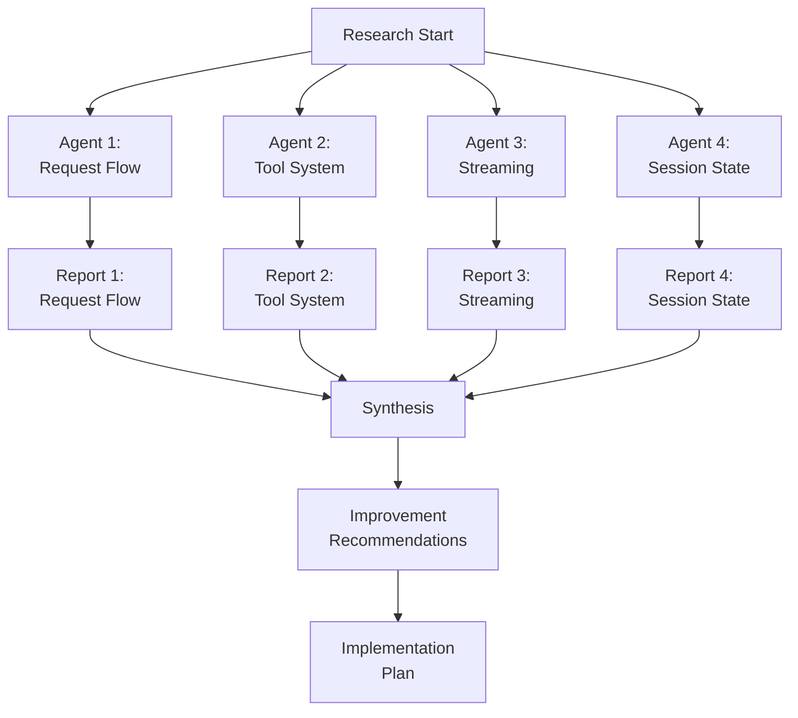

# Agent Swarm Research Workflow

## Purpose
Research how opencode's tooling works and identify improvements for our proxy setup.

## Research Agents

### Agent 1: Request Flow Researcher
**Task**: Map the complete request flow from user input to tool execution
**Focus Areas**:
- Session management (session.ts)
- Prompt construction (prompt.ts)
- Processor (processor.ts)
- LLM service (llm.ts)

**Deliverable**: Request flow diagram with latency measurements

### Agent 2: Tool System Researcher
**Task**: Map the complete tool calling lifecycle
**Focus Areas**:
- Tool registration (tools.ts)
- Tool execution (native-runtime.ts)
- AI SDK integration (ai-sdk.ts)
- Tool result handling

**Deliverable**: Tool call flow diagram with execution paths

### Agent 3: Streaming Researcher
**Task**: Map the streaming/SSE lifecycle
**Focus Areas**:
- HTTP transport (http.ts)
- SSE framing (framing.ts)
- AI SDK event mapping (ai-sdk.ts)
- Finish reason handling

**Deliverable**: Streaming format specification

### Agent 4: Session State Researcher
**Task**: Map session management and state
**Focus Areas**:
- Session creation/lifecycle
- Message storage
- State machine (idle/busy/retry)
- Event system

**Deliverable**: State diagram with transitions

---

## Research Workflow

---

## Research Methodology

### Phase 1: Codebase Exploration
1. Read all relevant source files
2. Document function signatures and purposes
3. Identify data flow patterns
4. Map dependencies between modules

### Phase 2: Latency Analysis
1. Identify all I/O operations
2. Measure typical durations
3. Find blocking calls
4. Identify optimization opportunities

### Phase 3: Architecture Review
1. Compare our proxy setup with native opencode
2. Identify bottlenecks
3. Find improvement opportunities
4. Document best practices

### Phase 4: Synthesis
1. Create Obsidian graph
2. Document findings
3. Create improvement plan
4. Prioritize optimizations

---

## Key Findings Summary

### What opencode Does Well
1. **Streaming**: Proper SSE format with tool_calls
2. **State Management**: Clean idle/busy/retry transitions
3. **Tool Execution**: Plugin hooks for before/after
4. **Error Handling**: Retry with exponential backoff
5. **Doom Loop Detection**: Prevents infinite loops

### What We Can Improve
1. **PoW Pre-solving**: Cache solved challenges
2. **Parallel Tool Calls**: Support multiple calls
3. **Context Optimization**: Reduce prompt size
4. **Connection Pooling**: Reuse browser sessions
5. **Response Caching**: Cache common responses

---

## Implementation Priorities

### High Priority (Immediate)
1. ✅ Fix streaming format (done)
2. ✅ Fix tool call detection (done)
3. ⬜ Add PoW caching
4. ⬜ Support parallel tool calls

### Medium Priority (Next Sprint)
1. ⬜ Optimize context size
2. ⬜ Add connection pooling
3. ⬜ Implement response caching
4. ⬜ Add retry logic

### Low Priority (Future)
1. ⬜ Native DeepSeek API support
2. ⬜ MCP server integration
3. ⬜ Advanced error recovery
4. ⬜ Performance monitoring

---

## Tools for Research

### Code Analysis
- `grep` - Search for patterns
- `glob` - Find files
- `read` - Read file contents
- `task` - Parallel research agents

### Documentation
- Obsidian graph format
- Mermaid diagrams
- Markdown reports
- Code annotations

### Testing
- curl commands
- Proxy testing
- opencode integration testing
- Latency measurements
