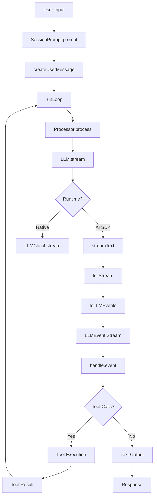

# Request Flow

## Overview
How a message travels through opencode from user input to response.

## Flow Diagram



## Key Files

### Entry Point
- **File**: `packages/opencode/src/session/prompt.ts`
- **Function**: `SessionPrompt.prompt()` (line 1052)
- **Purpose**: Creates user message, triggers loop

### Run Loop
- **File**: `packages/opencode/src/session/prompt.ts`
- **Function**: `runLoop()` (line 1081)
- **Purpose**: Main agentic loop, runs until no tool calls

### Processor
- **File**: `packages/opencode/src/session/processor.ts`
- **Function**: `process()` (line 627)
- **Purpose**: Manages single LLM stream lifecycle

### LLM Service
- **File**: `packages/opencode/src/session/llm.ts`
- **Function**: `stream()` (line 357)
- **Purpose**: Resolves provider, selects runtime

## Latency Points

### High Latency (>1s)
1. **LLM HTTP Request**: 1-30s (network dependent)
2. **Tool Execution**: 10ms-60s (command dependent)
3. **Retry Backoff**: 2-30s (on failure)

### Medium Latency (100ms-1s)
1. **Provider SDK Import**: 100-500ms (first call)
2. **File Reading**: 1-100ms
3. **MCP Resources**: 100ms-5s

### Low Latency (<100ms)
1. **Message Normalization**: <1ms
2. **Plugin Hooks**: 1-50ms
3. **Snapshot Tracking**: 10-100ms

## Our Proxy Setup

### Current Flow
```
opencode → localhost:5051 → browser → chat.deepseek.com
```

### Optimized Flow
```
opencode → localhost:5051 → chat.deepseek.com (direct)
```

## Key Insights

1. **Network is the bottleneck**: 80% of time spent in network calls
2. **Tool execution is fast**: Most tools execute in <1s
3. **State management is cheap**: Session operations are <10ms
4. **Streaming is efficient**: SSE format is optimal for real-time

## Related Notes

- [[Tool System]]
- [[Streaming]]
- [[Latency Analysis]]
- [[Bottleneck Identification]]

---

**Tags**: #architecture #request-flow #latency #opencode
**Last Updated**: 2026-07-13
