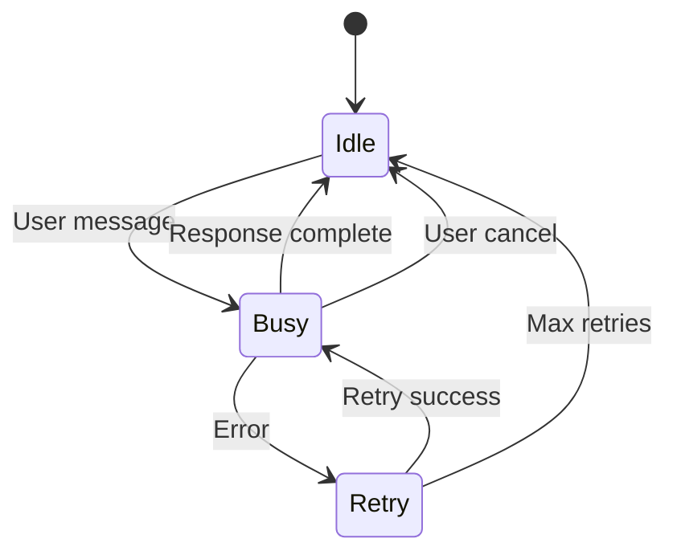

# Session Management

## Overview
How opencode manages sessions, messages, and state.

## Session Lifecycle



## Key Files

### Session CRUD
- **File**: `packages/opencode/src/session/session.ts`
- **Functions**: `create()`, `get()`, `messages()`
- **Purpose**: Session lifecycle management

### State Machine
- **File**: `packages/opencode/src/session/run-state.ts`
- **Functions**: `ensureRunning()`, `cancel()`
- **Purpose**: Per-session runner state

### Status
- **File**: `packages/opencode/src/session/status.ts`
- **Functions**: `get()`, `set()`
- **Purpose**: Status tracking (idle/busy/retry)

## Session States

### Idle
- No active LLM loop
- Waiting for user input
- Background jobs may run

### Busy
- LLM loop active
- Processing user message
- Executing tools

### Retry
- Error occurred
- Waiting to retry
- Exponential backoff

## Message Storage

### Database Schema
```sql
CREATE TABLE session (
  id TEXT PRIMARY KEY,
  project_id TEXT NOT NULL,
  created_at INTEGER NOT NULL,
  updated_at INTEGER NOT NULL
);

CREATE TABLE message (
  id TEXT PRIMARY KEY,
  session_id TEXT NOT NULL,
  role TEXT NOT NULL,
  content TEXT,
  created_at INTEGER NOT NULL
);

CREATE TABLE part (
  id TEXT PRIMARY KEY,
  message_id TEXT NOT NULL,
  type TEXT NOT NULL,
  content TEXT,
  status TEXT
);
```

### Part Types
- `text` - Text content
- `reasoning` - Model reasoning
- `tool-invocation` - Tool call/result
- `step-start` - Step boundary

## Event System

### EventV2Bridge
- **File**: `packages/opencode/src/event-v2-bridge.ts`
- **Purpose**: Publish/subscribe for updates

### Events
- `message.created` - New message
- `message.updated` - Message modified
- `part.created` - New part
- `part.updated` - Part modified
- `status.changed` - Session status changed

## Key Functions

### create() (session.ts:669)
```typescript
function create(input?: CreateInput): Effect<Info> {
  // Create session with model/agent/permissions
  // Store in database
  // Return session info
}
```

### messages() (session.ts:830)
```typescript
function messages(input: {sessionID, limit?}): Effect<WithParts[]> {
  // Load messages with parts
  // Paginated
  // Return sorted by creation time
}
```

### updatePart() (session.ts:637)
```typescript
function updatePart<T extends Part>(part: T): Effect<T> {
  // Persist part
  // Publish update event
  // Return updated part
}
```

### updatePartDelta() (session.ts:879)
```typescript
function updatePartDelta(input: {sessionID, messageID, partID, field, delta}): Effect<void> {
  // Stream incremental delta
  // Update part in database
  // Publish delta event
}
```

## State Transitions

### Idle → Busy
- Triggered by: User message
- Action: Start LLM loop
- Sets status to "busy"

### Busy → Idle
- Triggered by: Loop exit
- Action: Finalize message
- Sets status to "idle"

### Busy → Retry
- Triggered by: Retryable error
- Action: Start backoff
- Sets status to "retry"

### Retry → Busy
- Triggered by: Backoff complete
- Action: Retry LLM call
- Sets status to "busy"

### Retry → Idle
- Triggered by: Max retries
- Action: Return error
- Sets status to "idle"

## Key Insights

1. **State is per-session**: Each session has own runner
2. **Events are real-time**: Immediate updates to UI
3. **Parts are atomic**: Text, reasoning, tools are separate
4. **Cancellation is clean**: Background jobs cancelled on cancel

## Related Notes

- [[Request Flow]]
- [[Tool System]]
- [[Latency Analysis]]
- [[Bottleneck Identification]]

---

**Tags**: #session #state-management #database #opencode
**Last Updated**: 2026-07-13
