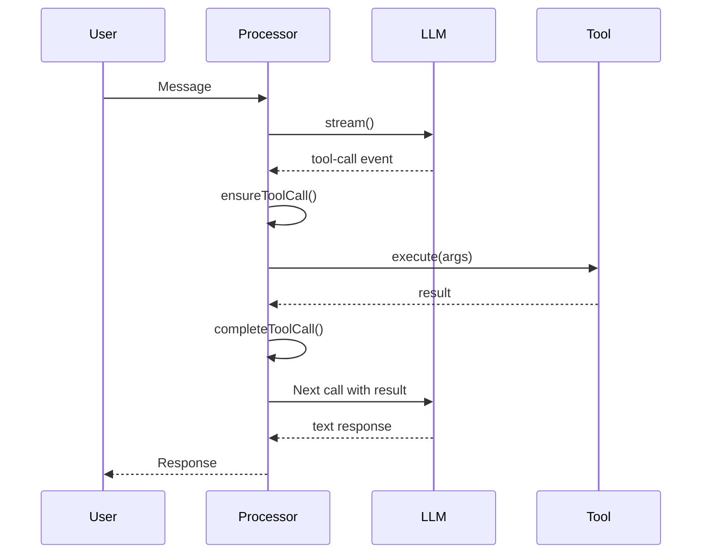

# Tool System

## Overview
How opencode handles tool calling from registration to execution.

## Tool Call Lifecycle



## Key Files

### Tool Registration
- **File**: `packages/opencode/src/session/tools.ts`
- **Function**: `resolve()` (line 41)
- **Purpose**: Resolves all tools into AI SDK format

### Tool Execution
- **File**: `packages/opencode/src/session/processor.ts`
- **Function**: `ensureToolCall()` (line 216)
- **Purpose**: Creates/updates tool part

### AI SDK Integration
- **File**: `packages/opencode/src/session/llm/ai-sdk.ts`
- **Function**: `toLLMEvents()` (line 76)
- **Purpose**: Maps AI SDK events to LLMEvents

## Tool Types

### Built-in Tools
- `bash` - Execute shell commands
- `read` - Read files
- `write` - Write files
- `edit` - Edit files
- `glob` - Find files
- `grep` - Search content
- `todowrite` - Task management
- `webfetch` - Fetch URLs
- `websearch` - Search web

### MCP Tools
- Connected via MCP servers
- Dynamically discovered
- Plugin hooks for execution

### Provider Tools
- Anthropic: web_search, code_execution
- OpenAI: web_search_call, file_search_call
- Provider-executed (not local)

## Execution Flow

### 1. Registration (tools.ts:41-134)
```typescript
for (const item of registry.tools()) {
  tools[item.name] = {
    description: item.description,
    parameters: item.parameters,
    execute: async (args) => {
      plugin.trigger("tool.execute.before", ...)
      const result = await item.execute(args, ctx)
      plugin.trigger("tool.execute.after", ...)
      return result
    }
  }
}
```

### 2. Stream Event (ai-sdk.ts:220-232)
```typescript
case "tool-call":
  return [LLMEvent.toolCall({
    id: event.toolCallId,
    name: event.toolName,
    input: event.input,
  })]
```

### 3. Processor Handling (processor.ts:331-380)
```typescript
case "tool-call":
  const { call, part } = await ensureToolCall(id, name)
  await updateToolCall(call, args)
  // Doom loop detection
```

### 4. Tool Execution (tools.ts:102-131)
```typescript
const output = await tool.execute(args, ctx)
return { output, attachments }
```

## Doom Loop Detection

### Algorithm (processor.ts:356-380)
1. Track last 3 tool calls
2. If identical (same name + args) → break loop
3. Return error message

### Purpose
- Prevent infinite loops
- Catch model confusion
- Save resources

## Our Proxy Tool Handling

### Current Implementation
```python
# Extract tool calls from model response
tool_calls = extract_tool_calls(content)

# Return in OpenAI streaming format
yield make_sse_chunk(chat_id, created, model, {
    "tool_calls": [{
        "id": call_id,
        "type": "function",
        "function": {"name": tool_name, "arguments": json.dumps(tool_args)}
    }]
})
```

### Supported Formats
1. **XML**: ``{"name": "bash", "arguments": {...}}``
2. **Plain JSON**: `{"name": "bash", "arguments": {...}}`
3. **Mixed**: Text + tool call

## Key Insights

1. **Tools are first-class**: opencode treats tools as equal to text
2. **Execution is local**: Tools execute on user's machine
3. **Results are contextual**: Tool results feed back to model
4. **Error handling is robust**: Retry, doom loop detection

## Related Notes

- [[Request Flow]]
- [[Streaming]]
- [[Session Management]]
- [[Improvement Opportunities]]

---

**Tags**: #tool-calling #architecture #execution #opencode
**Last Updated**: 2026-07-13
