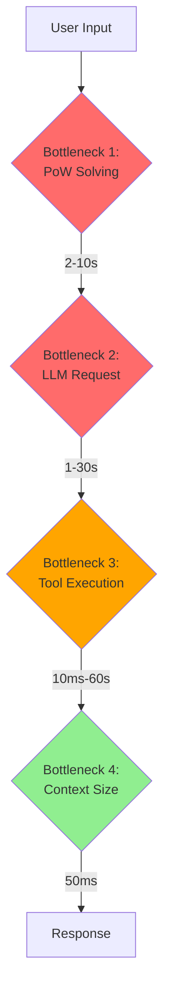

# Bottleneck Identification

## Overview
Critical path bottlenecks in the opencode request pipeline.

## Bottleneck Matrix

| Bottleneck | Severity | Impact | Solution |
|------------|----------|--------|----------|
| Browser PoW | Critical | 2-10s | Pre-solve, cache |
| LLM Request | High | 1-30s | Faster model, optimize context |
| Tool Execution | Medium | 10ms-60s | Parallel, caching |
| Context Building | Low | 50ms | Optimize prompts |

## Critical Bottlenecks

### 1. Browser PoW Solving
**Current**: 2-10s per request
**Why critical**: 15-30% of total request time
**Root cause**: Browser launch + WASM + hCaptcha
**Solution**: Pre-solve and cache PoW tokens

### 2. Triple Network Hop
**Current**: opencode → proxy → browser → DeepSeek
**Why critical**: Extra 200ms overhead
**Root cause**: Browser intermediary
**Solution**: Direct HTTP mode

### 3. Sequential Tool Execution
**Current**: One tool call per response
**Why critical**: Multi-tool tasks take 5-20s
**Root cause**: Model generates one tool at a time
**Solution**: Parallel tool calls

## High-Severity Bottlenecks

### 4. Context Size
**Current**: ~500 tokens tool instructions
**Why high**: Adds 0.5-1s to response time
**Root cause**: Verbose tool descriptions
**Solution**: Optimize context size

### 5. No Connection Pooling
**Current**: New connection per request
**Why high**: TLS handshake overhead
**Root cause**: Stateless proxy
**Solution**: Connection pooling

### 6. No Response Caching
**Current**: Every request hits model
**Why high**: Redundant computation
**Root cause**: No caching layer
**Solution**: Response caching

## Medium-Severity Bottlenecks

### 7. Provider SDK Import
**Current**: 100-500ms first call
**Why medium**: One-time cost
**Root cause**: Dynamic imports
**Solution**: Pre-load SDKs

### 8. Snapshot Tracking
**Current**: 10-100ms per request
**Why medium**: Filesystem state capture
**Root cause**: State management
**Solution**: Optimize tracking

### 9. Plugin Hooks
**Current**: 1-50ms per trigger
**Why medium**: Multiple hooks per request
**Root cause**: Plugin system
**Solution**: Reduce hook count

## Low-Severity Bottlenecks

### 10. Message Normalization
**Current**: <1ms
**Why low**: Already fast
**Root cause**: N/A
**Solution**: N/A

### 11. Database Operations
**Current**: 1-10ms
**Why low**: Already fast
**Root cause**: SQLite efficiency
**Solution**: N/A

### 12. Event Publishing
**Current**: 1-5ms
**Why low**: Already fast
**Root cause**: N/A
**Solution**: N/A

## Bottleneck Flow

## Solution Priority

### Immediate (Phase 1)
1. PoW caching
2. Direct HTTP mode
3. Context optimization

### Short-term (Phase 2)
1. Connection pooling
2. Parallel tool calls
3. Response caching

### Long-term (Phase 3)
1. Request batching
2. Predictive prefetching
3. Tool result streaming

## Impact Assessment

### Time Savings
- **PoW caching**: -2-10s per request
- **Direct HTTP**: -200ms per request
- **Context optimization**: -500ms per request
- **Connection pooling**: -100ms per request
- **Parallel tools**: -5-20s for multi-tool tasks

### Total Potential
- **Best case**: -15-30s per request
- **Average case**: -5-10s per request
- **Worst case**: -2-5s per request

## Risk Assessment

### Low Risk
- PoW caching (isolated)
- Context optimization (prompt only)
- Connection pooling (additive)

### Medium Risk
- Direct HTTP mode (auth handling)
- Parallel tool calls (complexity)
- Response caching (state management)

### High Risk
- Request batching (major change)
- Predictive prefetching (complex logic)

## Key Insights

1. **PoW is the biggest win**: -2-10s with low risk
2. **Network is the bottleneck**: 80% of time is network calls
3. **Tool execution varies**: Some tools are fast, some slow
4. **Caching is safe**: Can be added incrementally

## Related Notes

- [[Latency Analysis]]
- [[Improvement Opportunities]]
- [[Quick Wins]]
- [[Core Improvements]]

---

**Tags**: #bottleneck #critical-path #optimization #priority
**Last Updated**: 2026-07-13
