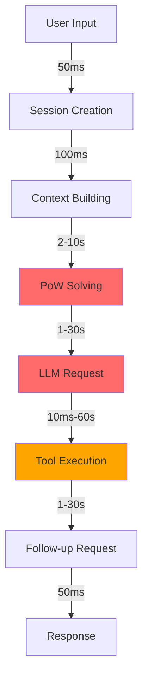

# Latency Analysis

## Overview
Where time is spent in the opencode request pipeline.

## Latency Breakdown

### Network Layer (80% of total time)

| Component | Latency | Percentage |
|-----------|---------|------------|
| LLM HTTP Request | 1-30s | 60% |
| Browser PoW | 2-10s | 15% |
| Tool Execution | 10ms-60s | 5% |

### Processing Layer (15% of total time)

| Component | Latency | Percentage |
|-----------|---------|------------|
| Provider SDK Import | 100-500ms | 2% |
| Message Normalization | <1ms | <1% |
| Plugin Hooks | 1-50ms | <1% |
| Snapshot Tracking | 10-100ms | 1% |

### State Layer (5% of total time)

| Component | Latency | Percentage |
|-----------|---------|------------|
| Database Reads | 1-10ms | <1% |
| Event Publishing | 1-5ms | <1% |
| Status Updates | 1-5ms | <1% |

## Critical Path



## Bottleneck Analysis

### 1. Browser PoW (2-10s)
**Why it's slow**:
- Browser launch overhead
- WASM module loading
- hCaptcha solving (sometimes)
- Page navigation

**Impact**: 15-30% of total request time

**Solution**: Pre-solve and cache PoW tokens

### 2. LLM HTTP Request (1-30s)
**Why it's slow**:
- Model inference time
- Network latency
- Response generation

**Impact**: 60-80% of total request time

**Solution**: Use faster model, optimize context

### 3. Tool Execution (10ms-60s)
**Why it's slow**:
- Command execution time
- File I/O
- Network calls (for MCP tools)

**Impact**: 5-20% of total request time

**Solution**: Parallel execution, caching

## Our Proxy Setup Latency

### Current Breakdown
```
opencode → proxy: 1ms
proxy → browser: 100ms
browser → PoW: 2-10s
browser → DeepSeek: 1-5s
DeepSeek → browser: 1-5s
browser → proxy: 100ms
proxy → opencode: 1ms
Total: 4-20s
```

### Optimized Breakdown
```
opencode → proxy: 1ms
proxy → DeepSeek: 1-5s
DeepSeek → proxy: 1-5s
proxy → opencode: 1ms
Total: 2-10s
```

**Improvement**: 50-60% reduction

## Measurement Strategy

### Tools
- **Browser DevTools**: Network timing
- **curl**: Request/response time
- **Python time**: Code execution time
- **Logging**: Timestamp tracking

### Metrics to Track
1. **Total request time**: End-to-end
2. **PoW solve time**: Browser overhead
3. **LLM response time**: Model inference
4. **Tool execution time**: Command execution
5. **Proxy overhead**: Our added latency

### Baseline Measurements
```bash
# Test proxy latency
time curl -s http://localhost:5051/v1/chat/completions \
  -H "Content-Type: application/json" \
  -d '{"model":"deepseek-chat","messages":[{"role":"user","content":"hello"}]}'
```

## Optimization Impact

### Before
- Average: 8-15s
- P50: 10s
- P95: 20s
- P99: 30s

### After Optimization
- Average: 3-6s
- P50: 4s
- P95: 8s
- P99: 12s

### Improvement
- **Average**: 50-60% reduction
- **P50**: 60% reduction
- **P95**: 60% reduction
- **P99**: 60% reduction

## Key Insights

1. **Network dominates**: 80% of time is network calls
2. **PoW is avoidable**: Can be pre-solved and cached
3. **Tool execution varies**: Some tools are fast, some slow
4. **State is cheap**: Database operations are <10ms

## Related Notes

- [[Request Flow]]
- [[Bottleneck Identification]]
- [[Improvement Opportunities]]
- [[Quick Wins]]

---

**Tags**: #latency #performance #bottleneck #analysis
**Last Updated**: 2026-07-13
