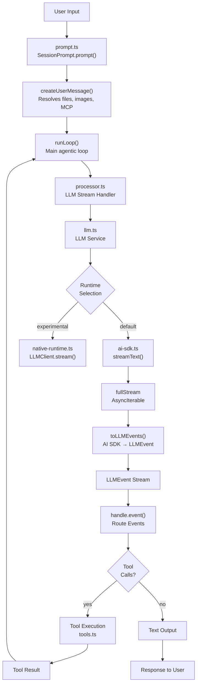
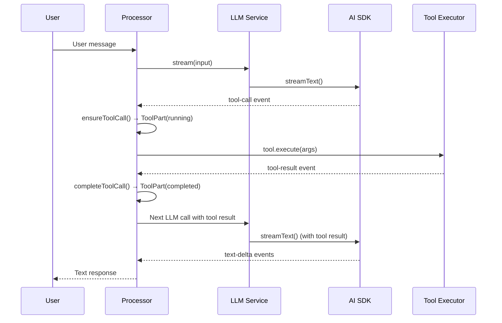
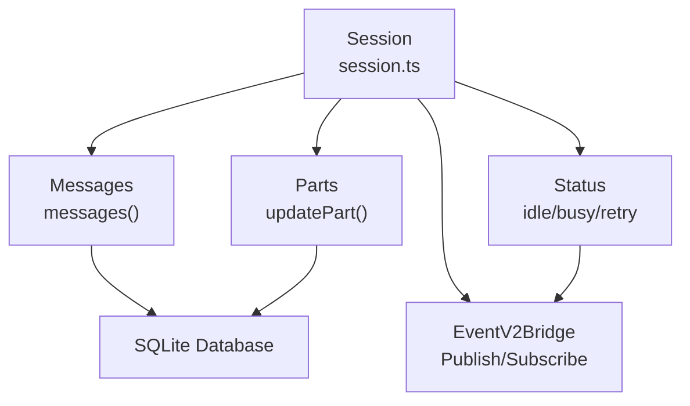
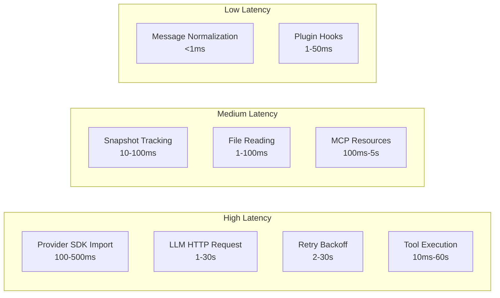
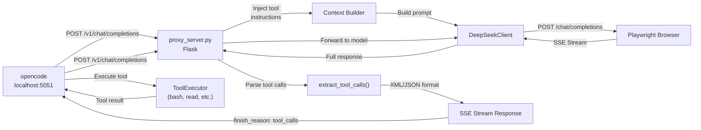

# opencode Request Flow Graph

## Core Flow

## Tool Call Lifecycle

## Session Management

## Latency Hotspots

## Proxy Layer (Our Current Setup)

## Key Files Reference

| File | Path | Purpose |
|------|------|---------|
| session.ts | packages/opencode/src/session/session.ts | Core session CRUD |
| prompt.ts | packages/opencode/src/session/prompt.ts | Prompt flow orchestration |
| processor.ts | packages/opencode/src/session/processor.ts | LLM stream handler |
| llm.ts | packages/opencode/src/session/llm.ts | LLM service + runtime selection |
| ai-sdk.ts | packages/opencode/src/session/llm/ai-sdk.ts | AI SDK → LLMEvent adapter |
| native-runtime.ts | packages/opencode/src/session/llm/native-runtime.ts | Native runtime adapter |
| tools.ts | packages/opencode/src/session/tools.ts | Tool resolution + execution |
| request.ts | packages/opencode/src/session/llm/request.ts | Request preparation |
| provider.ts | packages/opencode/src/provider/provider.ts | Provider registry |
| http.ts | packages/llm/src/route/transport/http.ts | HTTP transport |
| openai-chat.ts | packages/llm/src/protocols/openai-chat.ts | OpenAI chat protocol |
